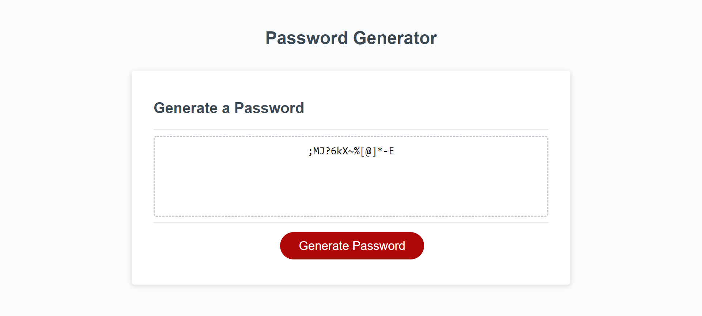

# JavaScript-Password-Generator

## Description
[Password Generator](https://darren-rogers.github.io/JavaScript-Password-Generator/)

This password generator has a working button that when clicked presents a series of prompts.  The prompts collect information to be used to generate the password such as length, lowercase and uppercase characters, and numbers and symbols.  The passwords must be between the length of 8 and 128 characters. When the password is generated it is generated in the console log and on the screen.

## Visuals

